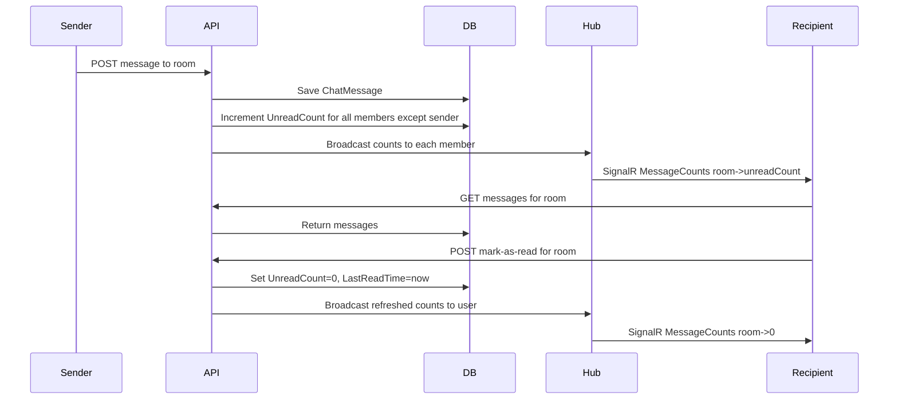

# SignalR Unread-Count Chat Implementation

## Goal
Simplest possible SignalR integration for the chat component. The hub pushes only a
**map of room-name -> unread message count** for the connected user — never message
payloads. When the user is viewing a chat room and a count update arrives, the
frontend re-GETs the messages via REST.

## Data model changes

### `ChatRoomUser` — add columns
- `UnreadCount` (int, default 0) — unread messages for this user in this room.
- `LastReadTime` (datetime2, nullable) — last time the user marked the room read.
- `CurrentSignalR` (datetime2, nullable) — watermark for the last SignalR
  notification sent, to avoid duplicate pushes in the future.
- `CurrentPushNotification` (datetime2, nullable) — watermark for the last push
  notification sent, to avoid duplicate pushes in the future.

### `ChatMessage` — remove
- `ReceivedAll` bool (dead code once `ChatMessageNotified` is gone).

### Remove entirely
- `ChatMessageNotified` entity + DbSet + config + migration table.

### DTO
- `ChatMessageDto` drops the `ReceivedAll` field.

## Backend changes

### `MessageService` / `IMessageService`
- `SendMessageAsync(roomName, username, content)`:
  - Save the `ChatMessage`.
  - Increment `UnreadCount` for every `ChatRoomUser` in the room **except the sender**.
  - Return the message.
- `GetMessagesAsync(roomName)`: unchanged (returns messages ordered by timestamp).
- `GetRoomCountsForUserAsync(username)`: returns `Dictionary<string,int>` of
  `roomName -> UnreadCount` for all rooms the user is a member of.
- New `MarkRoomAsReadAsync(roomName, username)`:
  - Set `UnreadCount = 0`, `LastReadTime = now` for that `ChatRoomUser`.
  - (Future: stamp `CurrentSignalR`/`CurrentPushNotification` watermarks.)

### `ChatHub`
- `OnConnectedAsync`: add connection to `User_{userId}` group, push initial counts.
- `RequestCounts(userId)`: push a fresh count snapshot to the caller.
- `NotifyUserCountsAsync(hubContext, messageService, userId)`: static helper used
  outside the hub to broadcast counts to a user group.

### `EndpointExtensions`
- `POST /api/rooms/{room}/messages`: after saving, broadcast refreshed counts to
  every member of the room via the hub.
- New `POST /api/rooms/{room}/read`: body `{ username }` — marks the room read for
  that user, then broadcasts refreshed counts to that user.

### Migration
- New EF migration: add the four columns to `ChatRoomUser`, drop
  `ChatMessageNotified` table, drop `ReceivedAll` column from `ChatMessages`.

## Frontend changes

### `ChatHubService` (already created)
- Connects to `/chathub?userId=...`.
- Listens for `MessageCounts` events (`Record<string, number>`).
- Exposes `onCounts(listener)` and `requestCounts()`.

### `ChatApiService`
- Add `markAsRead(room, username)` -> `POST /api/rooms/{room}/read`.
- Drop `receivedAll` from `ChatMessageDto`.

### `PageChatComponent`
- On init: connect hub for current user, subscribe to counts.
- When the unread count for the **current room** changes: re-GET messages.
- After loading messages (initial or via count update): call `markAsRead`.
- On room/user change: reset last-seen count, reconnect hub, reload, mark read.

## Sequence

## Out of scope (future)
- Push notification dedup using `CurrentSignalR` / `CurrentPushNotification`
  watermarks (columns added now, logic later).
- OneSignal integration (currently disabled).
- `BootRecoveryService` / `NotificationSweeper` background services (disabled).
